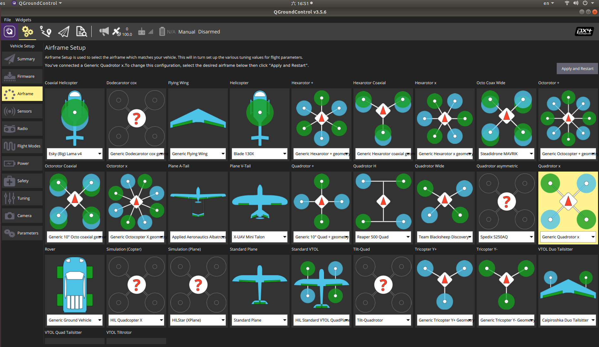
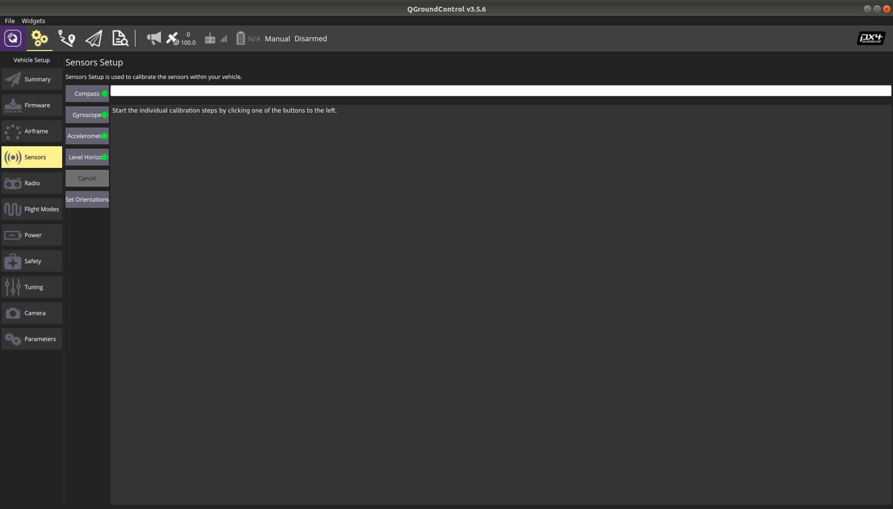
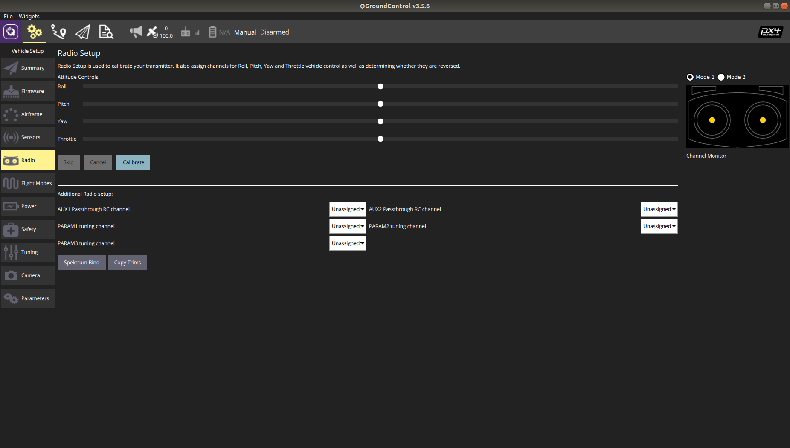
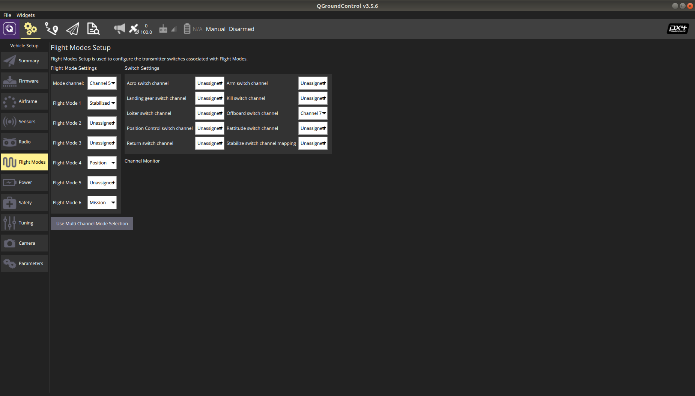
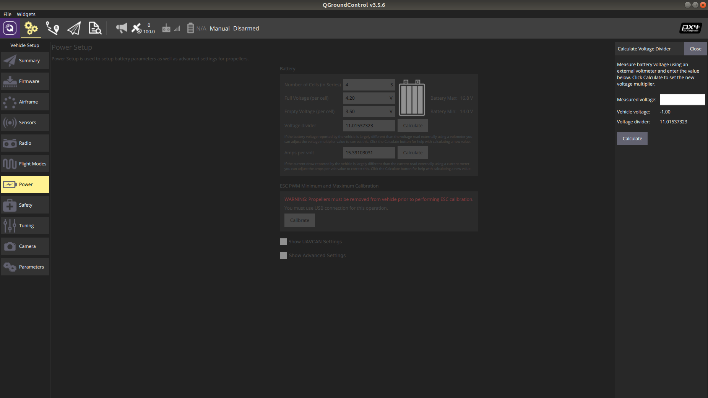

# Basic Setup

The Kerloud mini autopilot has been loaded with stable px4 firmware based on official px4 version V1.10.0 (still updating), and is ready to use for most users.

The basic setup procedure can be referred at: <https://dev.px4.io/master/en/setup/config_initial.html>. Main steps are shown as follows, which can be easily conducted via [QGroundControl](http://qgroundcontrol.com/) software:

## Airframe selection

Users can select various candidate airframes, such as multirotors, fixed-wing, rovers, and other configurations. Simply click “Apply and Restart” in the upper right corner will reboot the autopilot with default parameter settings.

## Sensor calibration

Calibration must be done for compass, gyroscope and accelerometers. The reminders are shown below:

Users are suggested to connect the Kerloud GPS to the autopilot before compass calibration, as the external compass is equipped in the GPS module, then both the onboard and external compasses will be calibrated.

Users should keep the autopilot absolutely static during gyroscope calibration, as even small motion can cause calibration failure or lead to unacceptable gyro bias.

Accelerometers can be placed on flat table surfaces or vertical walls for calibration. Hand-hold calibration is not recommended.

## Radio calibration

Users can select either right hand throttle (Mode 1, Japanese Hand) or left hand throttle (Mode 2, American Hand) for RC operation.

## Flight Modes

Users should allocate one channel (e.g. channel 5) for flight mode setting. For most users, flight modes should at least include STABILIZED, POSITION, MISSION. OFFBOARD mode might be set for advanced users.

## Power Calibration

Power setting has to be completed for battery monitoring. Users need to enter the battery cell number, and also measure the voltage with a multimeter for calibration.
