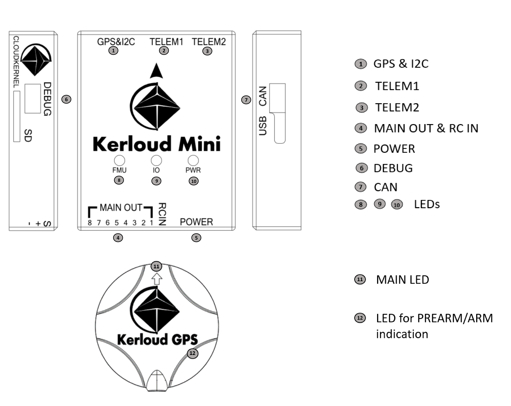

# Features and Specifications

## Key Features
(1) Optimized interface, minimized size with reduction of commonly unused ports.

(2) Dual sensor redundancy, equipped with high performance TDK ICM motion sensors.

(3) High extensibility for mission management, and concurrent support for telemetry, mission computer, and debug port for advanced users.

(4) Full ESD（Electro-Static Discharge）protection for interfaces with improved safety quality.

(5) User friendly design with external main LED and prearm/arm indication in GPS module.

(6) CNC Aluminium enclosure with enhanced Anti-EMI (electromagnetic interference) and better cooling.

(7) Long-term maintenance for both software and hardware, customized services with open source software support.

## Specifications
| Component | Specification |
| :--: | :--: |
| Main Processor |   STM32F427 Cortex M3, 2MB flash, 168 MHz |
| Coprocessor |  STM32F100 Cortex M3, 64KB flash, 24MHz |
| Accelerometer |   ICM20602, ICM20689 |
| Gyroscope |  ICM20602, ICM20689 |
| Magnetometer |  IST8310, QMC5883 |
| Barometer | ms5611 |
| Kerloud GPS Module |  Ublox M8N GPS |
| Supply Voltage |  Power port: 4.75V~5.5V,   USB port: 4.75V~5.25V,   default power module: 2~6S,   maximum sensing current 90A,   BEC: 5.3V, maximum continuous current 3A |
| Operating Temperature | -40 ~ 85 degrees|
| Enclosure| CNC Aluminium enclosure |
| Dimension | 57mm \* 45mm \* 14.6mm |
|Weight |Kerloud Mini Autopilot: 40g    Kerloud GPS: 30g |

