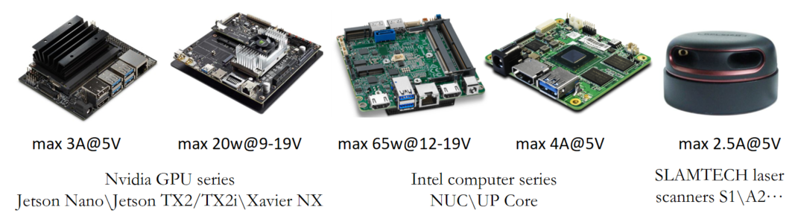

# Kerloud Lite Power Module

The Kerloud Lite power module is a reliable power source provided by Cloudkernel Technologies (Shenzhen) Co.,Ltd for unmanned systems.
Besides its capabilities to power up the flight controller, electrical speed controllers, and monitor the battery voltage and current, it also
provide flexible power ports to enhance system integration and stability.

The Kerloud Lite power module can support a wide range of common peripherals for drones, including Intel x86 and Nvidia mission computers, laser scanners, cameras and gimbals, hence suffice the need of various applications.

## Specifications

| Metric | Specification | Remark |
| :--: | :--: | :--: |
|Maximum continuous current in main board| 160A, typical | |
|Maximum continuous current for the DC 5V main port| 3A | |
|Maximum continuous current for the DC 5V Auxiliary port| 5A | |
|Maximum continuous current for the DC 14V Auxiliary port| 5A | |
|Input voltage range| DC 7.4~33.6V (2~8S Lipo battery) | |
|Size| 54mm\*54mm\*7mm | |
|Weight| 40g | including the dafault XT60 cable|

**Notes:**

(1) The default XT60 cable (12AWG) allows norminal 30A and maximum 60A current, and can be used for small current senarios only.

To support a maximum 160A continuous current, users have to change the cable and corresponding battery connectors. The recommended configuration is:

cable: 1/0 AWG or higher;

battery connector: ANCHI 175A600V dual pole connector.

(2) The 14V auxillary power port is enabled with 4~8S input voltage only. The 5V auxillary power is always available.

## Package List

| Component | QTY |
| :--: | :--: |
| Kerloud Power Module | 1 |
|10 cm XT60 cable | 1 | 
|6 pin GH cable (28AWG)| 1 |
|user manual| 1 |

## Interface

(1) external battery power input;

(2) ESC (Electrical Speed Controller) powering port, 4 ports maximum;

(3) 5V/5A auxillary powering port;

(4) 5V/3A main powering port, wherein "I" and "V" represent current and voltage sensing output respectively;

(5) 14V/5A auxillary powering port.

**Caution:** 

Reversed power connections for the anode and cathode can lead to permanent hardware damage.

## How to Purchase

For users in mainland China, please purchase via our official Taobao shop:

<https://item.taobao.com/item.htm?spm=a230r.1.14.16.3da24c99xNYTx4&id=631384658750&ns=1&abbucket=8#detail>

For other users, please consult local agents for details or write us an email <cloudkerneltech@gmail.com> .

