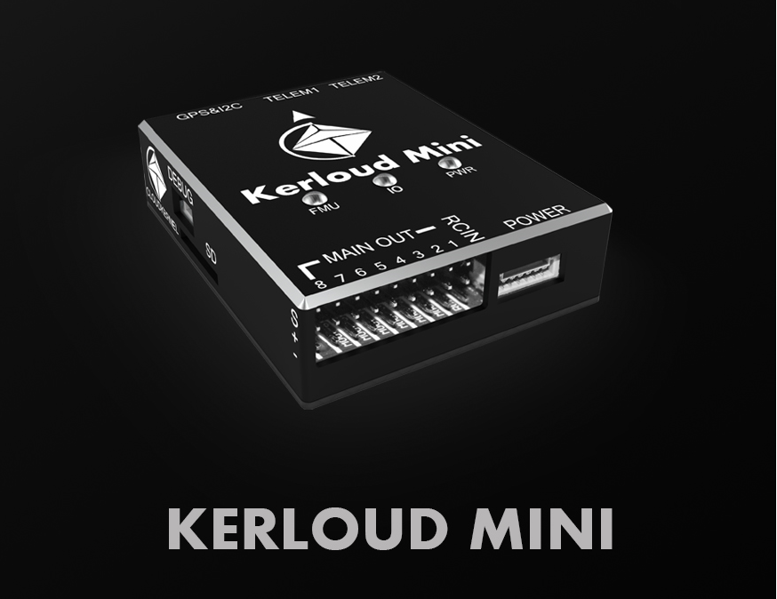
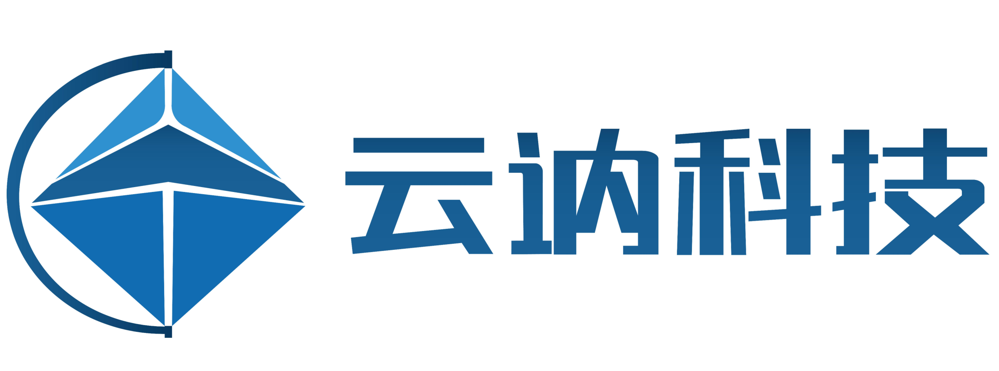

# Introduction

The Kerloud Mini autopilot is a stable mini autopilot enabling autonomous flights for unmanned aerial vehicles. It is designed to
meet both software and hardware standards from the PX4 community. The Kerloud autopilots are presented by Cloudkernel Technologies (Shenzhen) Co., Ltd with long-term support.

## About us

Cloudkernel Technologies (Shenzhen) is a technology-driven company geared towards science and education industries with key strengths in intelligent hardware and software solutions. We aims to provide high-quality products for science education. Currently, we offer the following main products and services:

(1) Education products in unmanned system field, including programmable UAVs, self-driving cars and AI education.

(2) Industry level UAV solutions, including autopilot hardware, flight control software and UAV application software suite.

Our main webpage is: <http://cloudkernel-tech.github.io>, and you may contact us by dropping us an email: <cloudkerneltech@gmail.com>.

## How to purchase
For users in mainland China, please purchase via our official Taobao shop:

<https://item.taobao.com/item.htm?spm=a2oq0.12575281.0.0.3bb71debPVMsFV&ft=t&id=622263169337>

For other users, please consult local agents for details or write us an email.
