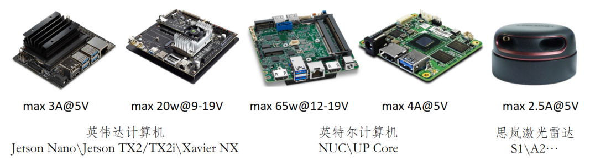
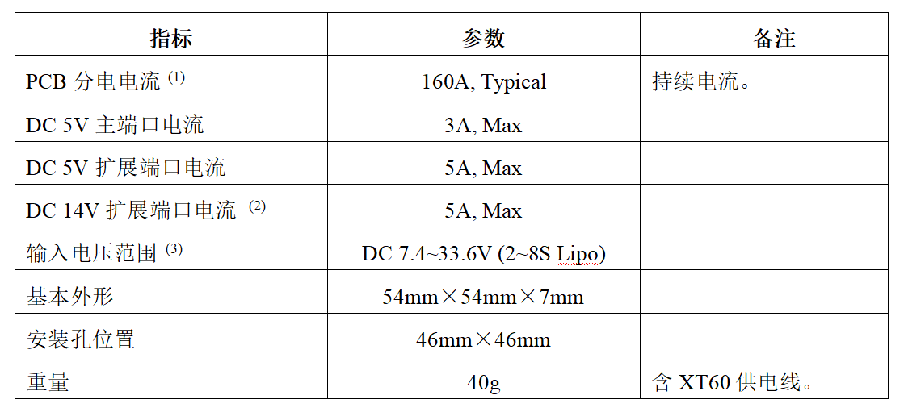
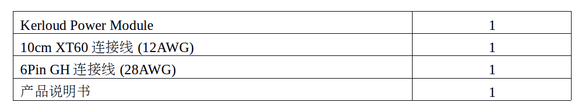
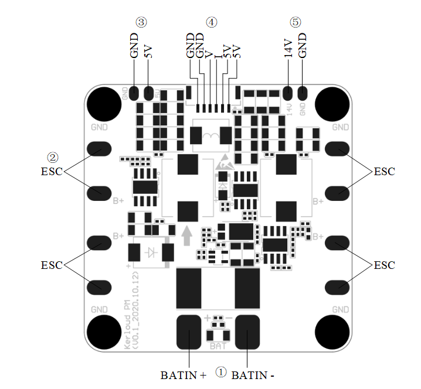

# Kerloud Lite 供电模块

Kerloud Lite 是由云讷科技推出的一款面向无人系统、高集成度的多功能电源模块，除了具备基本的向主控供电、为电调分电、提供电池电压/电流监测功能外，还拥有强大的扩展电源端口，可有效提升系统集成度、增强运行稳定性。

Kerloud Lite可以给常见的Intel x86和Nvidia等上位机，激光雷达，云台和相机等供电，满足用户的多方面要求。

## 参数

**注意：**

(1) 标配XT60转接线（12AWG）支持额定30A、瞬时60A电流，满足中小电流应用场景；

如需使用160A持续分电电流，需自行更换电池、电源模块端连接线及端子，建议规格：

连接线：1/0AWG以上；

端子：安德森175A600V双极连接器。

(2)(3) 14V扩展电源仅在4S~8S供电下正常输出，2S时截止；5V输出无此限制。

## 包装清单

## 接口

各接口描述如下：

① 外部电源输入；

② 电调供电接口，最多支持四路；

③ 5V/5A扩展接口；

④ 5V/3A供电接口，其中“I”、“V”分别为电流、电压监测信号输出；

⑤ 14V/5A扩展接口。

注意：各供电端口连接时需注意正负极，防止因反接导致硬件永久性损坏。

## 如何购买

中国大陆用户可以通过淘宝链接在云讷科技官方店铺购买：

<https://item.taobao.com/item.htm?spm=a230r.1.14.16.3da24c99xNYTx4&id=631384658750&ns=1&abbucket=8#detail>

其他地区用户可以咨询当地代理商或者发邮件给我们<cloudkerneltech@gmail.com> 。

