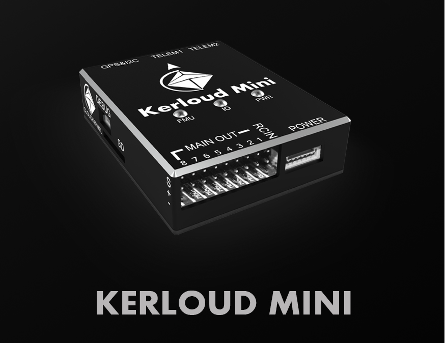
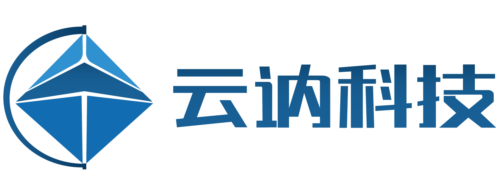

##介绍

Kerloud Mini飞控是一款稳定的小型飞控,用于支持无人机的自动飞行,它的设计遵循PX4社区的软件和硬件标准。Kerloud系列飞控由云讷科技(深圳)有限公司提供,并会被长期支持。

##关于我们

云讷科技（深圳）有限公司是一家立足智能软硬件技术积累，面向科技教育行业的公司，公司旨在提供优质的科技教育产品，传播科技文化。公司现提供以下产品和服务：

1. 提供基于无人系统技术的教育产品和课程，如可编程无人机/无人车、人工智能教育等

2. 公司提供部分无人机行业核心解决方案，如飞行控制器，无人机操作系统等

我们的产品主页是<https://cloudkernel-tech.github.io>, 您可以通过电子邮件：<cloudkerneltech@gmail.com> 联系到我们．微信用户可以扫描下面的二维码关注我们的公众号：

## 如何购买

中国大陆用户可以前往我们官方淘宝店铺购买：

<https://item.taobao.com/item.htm?spm=a2oq0.12575281.0.0.3bb71debPVMsFV&ft=t&id=622263169337>

其他地区用户可以咨询当地代理商或者发邮件给我们．

